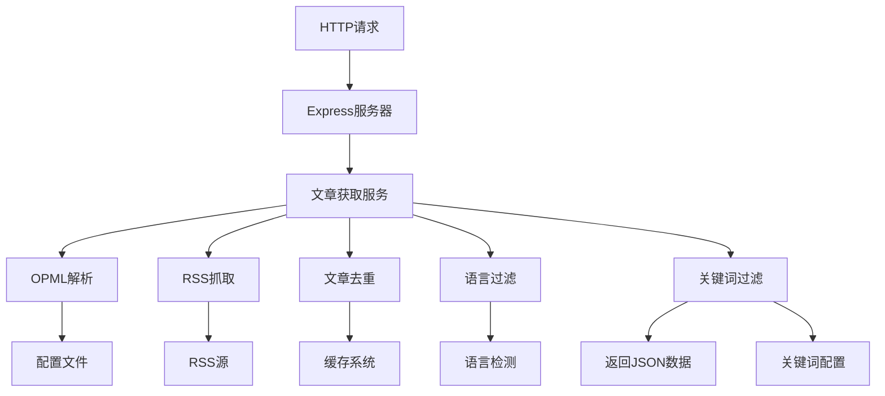
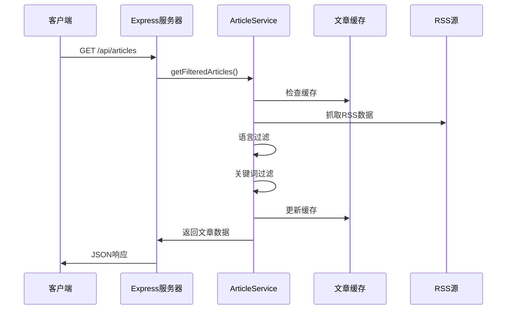

# RSS文章数据接口开发

## 需求分析

根据用户需求，需要将现有的RSS抓取和过滤逻辑封装为HTTP接口，返回经过处理的文章数据。具体要求：

1. 保留现有的RSS抓取、去重、语言过滤、关键词过滤功能
2. 移除AI筛选和钉钉推送功能  
3. 通过HTTP接口返回 <kfile name="index.ts" path="src/index.ts">index.ts</kfile> 第111-112行的 `newArticles` 数据

## 技术方案

### 1. 架构设计



### 2. 接口设计

#### 2.1 获取文章列表接口

**接口路径**: `GET /api/articles`

**查询参数**:
- `limit`: 可选，限制返回文章数量，默认不限制
- `category`: 可选，按分类筛选文章
- `refresh`: 可选，是否强制刷新缓存，默认false

**响应格式**:
```json
{
  "success": true,
  "data": {
    "articles": [
      {
        "title": "文章标题",
        "link": "文章链接",
        "published": "发布时间",
        "summary": "文章摘要",
        "feedName": "RSS源名称",
        "category": "分类"
      }
    ],
    "total": 100,
    "processInfo": {
      "totalFetched": 150,
      "afterDeduplication": 120,
      "afterLanguageFilter": 100,
      "afterKeywordFilter": 80
    }
  },
  "timestamp": "2024-01-01T00:00:00Z"
}
```

### 3. 代码结构调整

#### 3.1 新增文件

1. **HTTP服务器**: <kfile name="server.ts" path="src/server.ts">src/server.ts</kfile>
2. **文章服务**: <kfile name="article-service.ts" path="src/services/article-service.ts">src/services/article-service.ts</kfile>
3. **路由控制器**: <kfile name="article-controller.ts" path="src/controllers/article-controller.ts">src/controllers/article-controller.ts</kfile>

#### 3.2 修改现有文件

1. **主入口文件**: 修改 <kfile name="index.ts" path="src/index.ts">src/index.ts</kfile>，提取核心逻辑为可复用的服务
2. **包配置**: 更新 <kfile name="package.json" path="package.json">package.json</kfile>，添加Express依赖

### 4. 实现细节

#### 4.1 核心服务抽取

将 <ksymbol name="runTask" filename="index.ts" path="src/index.ts" startline="14" type="function">runTask</ksymbol> 函数中的逻辑抽取为 `ArticleService` 类：

```typescript
export class ArticleService {
  async getFilteredArticles(options?: {
    limit?: number;
    category?: string;
    refresh?: boolean;
  }): Promise<{
    articles: Article[];
    processInfo: ProcessInfo;
  }> {
    // 1. 解析OPML
    // 2. RSS抓取
    // 3. 去重处理
    // 4. 语言过滤
    // 5. 关键词过滤
    // 6. 返回结果
  }
}
```

#### 4.2 HTTP服务器实现

使用Express框架创建HTTP服务器：

```typescript
import express from 'express';
import { ArticleController } from './controllers/article-controller.js';

const app = express();
const articleController = new ArticleController();

app.get('/api/articles', articleController.getArticles);
app.listen(3000, () => {
  console.log('RSS文章接口服务启动在端口3000');
});
```

#### 4.3 数据流程



### 5. 配置调整

#### 5.1 新增服务器配置

在 <kfile name="config.yaml" path="config/config.yaml">config/config.yaml</kfile> 中添加：

```yaml
server:
  port: 3000
  cors: true
  
api:
  default_limit: 50
  max_limit: 200
```

#### 5.2 移除不需要的配置

- 移除 `ai` 相关配置
- 移除 `dingtalk` 相关配置
- 保留 `scheduler` 配置（可选择性启用定时更新缓存）

### 6. 部署方案

#### 6.1 开发模式

```bash
npm run dev:server  # 启动HTTP服务器
```

#### 6.2 生产模式

```bash
npm run build
npm run start:server
```

### 7. 边界情况处理

| 场景 | 处理方式 | 代码位置 |
|------|----------|----------|
| RSS源无法访问 | 跳过该源，记录错误日志 | <ksymbol name="fetchFeed" filename="rss-fetcher.ts" path="src/fetchers/rss-fetcher.ts" startline="33" type="function">RSSFetcher.fetchFeed</ksymbol> |
| 配置文件缺失 | 返回500错误，提示配置问题 | <kfile name="article-service.ts" path="src/services/article-service.ts">ArticleService</kfile> |
| 缓存文件损坏 | 重新初始化缓存 | <ksymbol name="load" filename="article-cache.ts" path="src/cache/article-cache.ts" type="function">ArticleCache.load</ksymbol> |
| 关键词配置为空 | 跳过关键词过滤 | <kfile name="article-service.ts" path="src/services/article-service.ts">ArticleService</kfile> |
| 请求参数超出限制 | 使用默认限制值 | <kfile name="article-controller.ts" path="src/controllers/article-controller.ts">ArticleController</kfile> |
| 并发请求过多 | 实现请求队列或限流 | <kfile name="server.ts" path="src/server.ts">Express中间件</kfile> |
| 文章内容为空 | 过滤掉空内容文章 | 当前已在第111行实现 |
| 网络超时 | 设置合理超时时间，失败重试 | <ksymbol name="RSSFetcher" filename="rss-fetcher.ts" path="src/fetchers/rss-fetcher.ts" startline="19" type="function">RSSFetcher构造函数</ksymbol> |